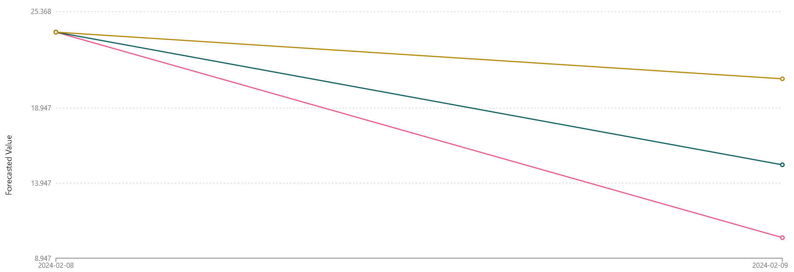
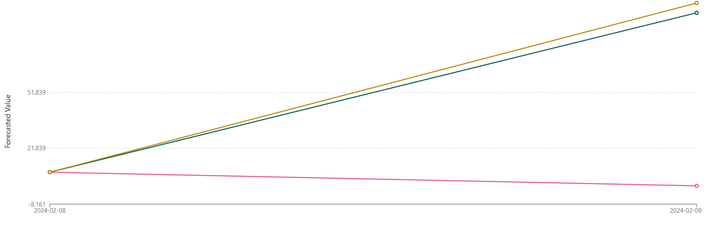

## 📊 Análise dos Resultados do Modelo

Após o treinamento do modelo de previsão de estoque utilizando o AWS SageMaker Canvas, foram obtidas as seguintes métricas de desempenho:

- **Avg. wQL (Average Weighted Quantile Loss):** `0.060`
- **MAPE (Mean Absolute Percentage Error):** `0.148`
- **WAPE (Weighted Absolute Percentage Error):** `0.100`
- **RMSE (Root Mean Squared Error):** `5.765`
- **MASE (Mean Absolute Scaled Error):** `0.301`

### Interpretação das Métricas

1. **Avg. wQL (0.060):**
   - Esta métrica indica que o modelo está relativamente próximo dos valores reais, considerando a distribuição dos dados. Um valor de 0.060 sugere que as previsões do modelo têm uma precisão aceitável, especialmente em cenários onde a previsão por intervalos é relevante.

2. **MAPE (0.148):**
   - Com um MAPE de 0.148, o modelo apresenta um erro percentual médio de 14,8%. Isso significa que, em média, as previsões do modelo diferem em cerca de 14,8% dos valores reais. Para muitas aplicações de previsão de estoque, esse valor pode ser considerado bom, dependendo da volatilidade do mercado e da natureza dos dados.

3. **WAPE (0.100):**
   - O WAPE de 0.100 sugere que, ponderando as previsões de acordo com a importância dos diferentes itens no estoque, o modelo tem um erro médio de 10%. Isso é um sinal de que o modelo está fazendo um bom trabalho em geral, especialmente ao prever itens de maior valor ou volume.

4. **RMSE (5.765):**
   - O RMSE de 5.765 indica a magnitude do erro nas previsões, com maior peso dado a grandes desvios. Embora o valor absoluto do RMSE dependa da escala dos dados, ele sugere que há variações nos erros, com alguns valores previstos estando significativamente fora dos valores reais. Este é um ponto a ser observado, especialmente se houver dados outliers que possam estar afetando a performance do modelo.

5. **MASE (0.301):**
   - O MASE de 0.301 mostra que o modelo comete cerca de 30,1% do erro que um modelo de referência simples (como um modelo de persistência) cometeria. Isso sugere que o modelo atual é uma melhoria significativa em relação a previsões mais básicas, o que reforça a utilidade do modelo para previsões de estoque.

### Considerações Finais

No geral, as métricas indicam que o modelo tem um desempenho robusto para a tarefa de previsão de estoque, com um equilíbrio aceitável entre precisão e erro. No entanto, o RMSE sugere que há variação nos erros, o que pode merecer uma investigação mais detalhada, especialmente se houver outliers ou se o desempenho do modelo precisar ser ajustado para casos específicos. Se necessário, ajustes adicionais no modelo ou nos dados de entrada podem ser feitos para melhorar ainda mais a precisão das previsões.

## 🔍 Análise da Previsão para o Produto de ID 1000

Para o produto de ID 1000, o modelo de previsão gerou os seguintes percentis:

- **P10 (10º Percentil):** `10.316`
- **P50 (50º Percentil / Mediana):** `15.166`
- **P90 (90º Percentil):** `20.894`
- **Demanda Histórica:** `24`

### Interpretação dos Percentis

1. **P10 = 10.316:**
   - Esse valor indica que há 10% de chance de que a demanda futura seja de 10,316 unidades ou menos. Este percentil representa uma estimativa conservadora da demanda, considerando cenários de menor demanda.

2. **P50 = 15.166:**
   - O P50, ou mediana, sugere que a demanda prevista é de 15,166 unidades. Isso significa que, com base no modelo, há 50% de chance de que a demanda real seja menor ou maior que esse valor. A mediana é uma boa medida central e é frequentemente usada como referência principal.

3. **P90 = 20.894:**
   - O P90 indica que há 90% de chance de que a demanda futura seja de 20,894 unidades ou menos. Esse percentil é útil para entender o que esperar em um cenário de alta demanda.

### Comparação com a Demanda Histórica

A demanda histórica para o produto de ID 1000 foi de `24` unidades. Comparando esse valor com os percentis:

- A demanda histórica de `24` está acima do P90 (`20.894`), indicando que a demanda passada foi maior do que o que o modelo prevê para a maioria dos cenários futuros.
- Isso sugere que, ou a demanda histórica foi excepcionalmente alta em relação às condições atuais, ou que o modelo prevê uma diminuição na demanda para este produto.

### Considerações e Ações Recomendadas

- **Revisão dos Dados:** Pode ser útil revisar os dados históricos e as condições que influenciaram a demanda passada. Se houver fatores sazonais ou eventos específicos que possam não se repetir, o modelo pode estar correto em prever uma demanda menor.
- **Ajuste de Previsões:** Se a demanda histórica de 24 unidades for considerada um ponto de referência importante, pode-se considerar ajustar o modelo ou utilizar técnicas adicionais para capturar picos de demanda.
- **Gestão de Estoque:** Dada a previsão mais baixa, você pode optar por manter um estoque menor para evitar excessos, a menos que outros fatores justifiquem a manutenção de níveis mais altos de estoque.

### Conclusão

A previsão sugere uma demanda futura menor do que a registrada historicamente. Dependendo do contexto e da confiança nos dados históricos, pode ser necessário ajustar as estratégias de inventário ou revisar as condições de mercado que podem estar impactando as previsões.

## 🔍 Análise da Previsão para o Produto de ID 1022

Para o produto de ID 1022, o modelo de previsão gerou os seguintes percentis:

- **P10 (10º Percentil):** `1.672`
- **P50 (50º Percentil / Mediana):** `94.725`
- **P90 (90º Percentil):** `99.999`
- **Demanda Histórica:** `9`

### Interpretação dos Percentis

1. **P10 = 1.672:**
   - Esse valor indica que há 10% de chance de que a demanda futura seja de 1,672 unidades ou menos. Isso sugere que, em um cenário conservador, o modelo prevê uma demanda bem baixa, próxima da demanda histórica.

2. **P50 = 94.725:**
   - O P50, ou mediana, indica que a demanda prevista é de 94,725 unidades. Este valor é consideravelmente mais alto do que a demanda histórica de 9 unidades, sugerindo que o modelo espera um aumento significativo na demanda para este produto.

3. **P90 = 99.999:**
   - O P90 indica que há 90% de chance de que a demanda futura seja de 99,999 unidades ou menos. Isso reflete um cenário de alta demanda, quase no limite do que o modelo prevê como possível.

### Comparação com a Demanda Histórica

A demanda histórica para o produto de ID 1022 foi de `9` unidades. Comparando esse valor com os percentis:

- **P10 = 1.672** é o mais próximo da demanda histórica, mas ainda abaixo do valor real, sugerindo que, em casos extremos de baixa demanda, o modelo prevê uma quantidade ainda menor que a registrada historicamente.
- **P50 = 94.725** e **P90 = 99.999** estão significativamente acima da demanda histórica de `9` unidades. Isso pode indicar que o modelo está considerando fatores que sugerem uma grande elevação na demanda futura, o que é incomum em relação aos padrões históricos.

### Considerações e Ações Recomendadas

- **Verificação dos Dados:** Dado o grande desvio entre a demanda histórica e as previsões para P50 e P90, é importante revisar os dados históricos e as variáveis usadas no modelo. Pode haver fatores recentes ou contextuais que o modelo está capturando e que podem justificar esse aumento significativo na previsão.
  
- **Planejamento de Estoque:** Se o modelo estiver correto em prever uma demanda tão alta, será necessário ajustar o planejamento de estoque para garantir que a empresa possa atender à demanda sem sofrer com falta de produtos. No entanto, considerando o histórico de baixa demanda, esse ajuste deve ser feito com cautela para evitar excesso de estoque.
  
- **Reavaliação do Modelo:** Considere reavaliar o modelo, especialmente se não houver razões claras para esperar um aumento tão grande na demanda. Pode ser necessário ajustar os parâmetros ou revisar a seleção de features.

### Conclusão

A previsão para o produto de ID 1022 mostra uma discrepância significativa entre a demanda histórica e as previsões futuras. Isso sugere uma possível mudança radical no comportamento da demanda ou uma necessidade de reavaliação do modelo. É essencial investigar as razões por trás dessas previsões antes de tomar decisões estratégicas de inventário.
